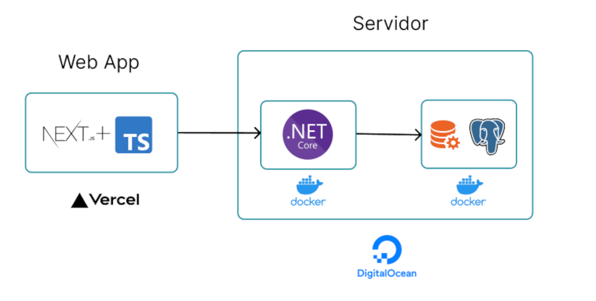

# Aplicación Web Desplegada -> https://employees-crud-front-end.vercel.app/

# Descripción
CRUD de Empleados con datos encriptados usando el algoritmo AES a nivel BDD con PostgreSQL

# Arquitectura
- Front end: NextJS + Typescript alojado en Vercel
- Back end: ASP.NET Core + PostgreSQL alojado en Digital Ocean

## Diagrama de arquitectura


# Encriptación de datos:
Los datos de los empleados son encriptados con PostgreSQL mediante las siguientes dos funciones:
- pgp_sym_encrypt()
- pgp_sym_decrypt()

## Encriptar datos al insertar empleado
A continuación se muestra el código SQL para encriptar e insertar un empleado y su domicilio.
Con ayuda de C# se establece el valor de todas las variables que inician con '@' para evitar inyecciones de SQL.

```sql
INSERT INTO employee (full_name, email, phone, address_id, monthly_salary_usd) 
VALUES (
    pgp_sym_encrypt(@FullName, @Secret),
    pgp_sym_encrypt(@Email, @Secret), 
    pgp_sym_encrypt(@Phone, @Secret),
    @AddressId, 
    @MonthlySalaryUSD
);

INSERT INTO address (city, street_name, street_number)
VALUES (
    pgp_sym_encrypt(@City, @Secret),
    pgp_sym_encrypt(@StreetName, @Secret),
    pgp_sym_encrypt(@StreetNumber, @Secret)
);
```

## Desencriptar datos al leer un empleado
A continuación se muestra el código SQL para desencriptar y leer un empleado y su domicilio.

```sql
SELECT 
    id,
    pgp_sym_decrypt(full_name::bytea, @Secret) AS full_name,
    pgp_sym_decrypt(email::bytea, @Secret) AS email,
    pgp_sym_decrypt(phone::bytea, @Secret) AS phone,
    monthly_salary_usd,
    pgp_sym_decrypt(city::bytea, @Secret) AS city,
    pgp_sym_decrypt(street_name::bytea, @Secret) AS street_name,
    pgp_sym_decrypt(street_number::bytea, @Secret) AS street_number
FROM employee
INNER JOIN address ON employee.address_id = address.address_id;
```

# Repositorio del Front End
Enlace al repositorio del código del front end:
https://github.com/AlexAnguloMtz/Employees_CRUD_front_end
